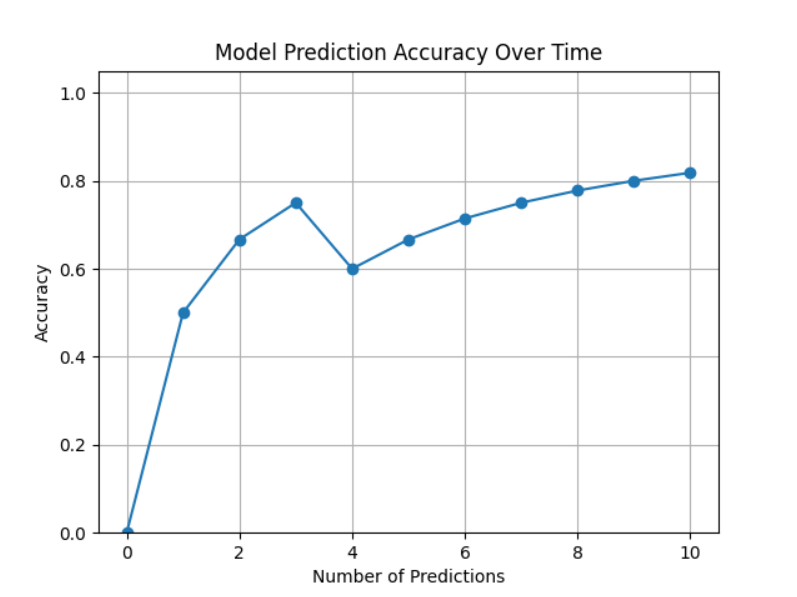

# Image Classifier

This Python application allows users to draw images and train a machine learning model to classify those images. After each prediction, the user is prompted to provide feedback on whether the prediction was accurate. Users can either define three custom classes or choose to get three randomly generated ones. The application also features an accuracy visualization tool that tracks the model's prediction accuracy over time. This project is inspired by NeuralNine.

## Setup

- Install all the dependencies from the requirements.txt file
- Run the gui.py file
- Make a new project
- Train the model by drawing the image and the clicking on your drawn class, then click on Train model
- Have the model predict your drawings

## Demo

